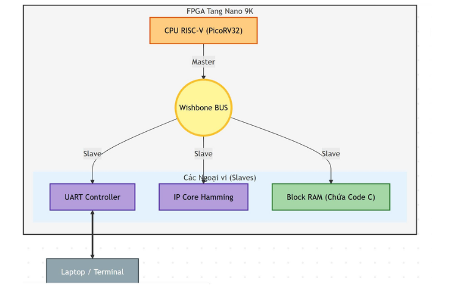
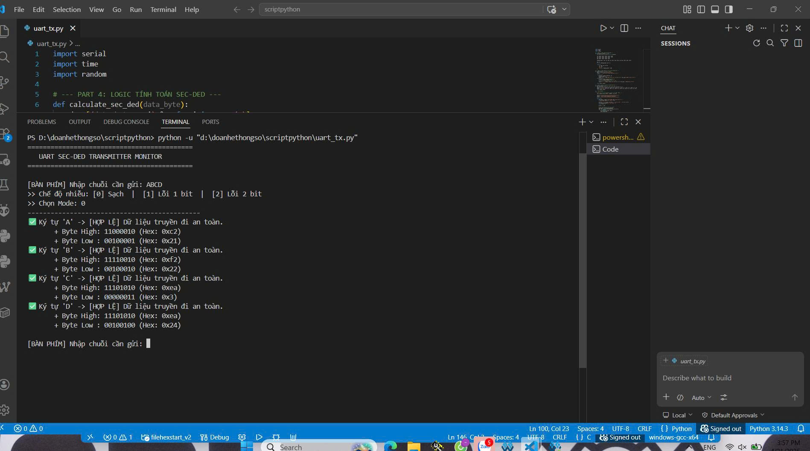
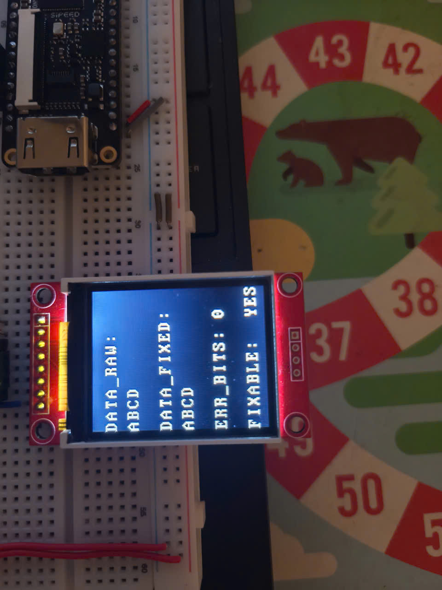
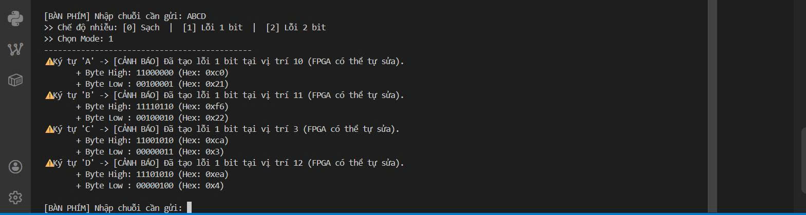
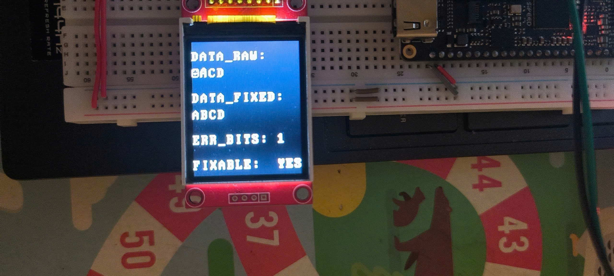
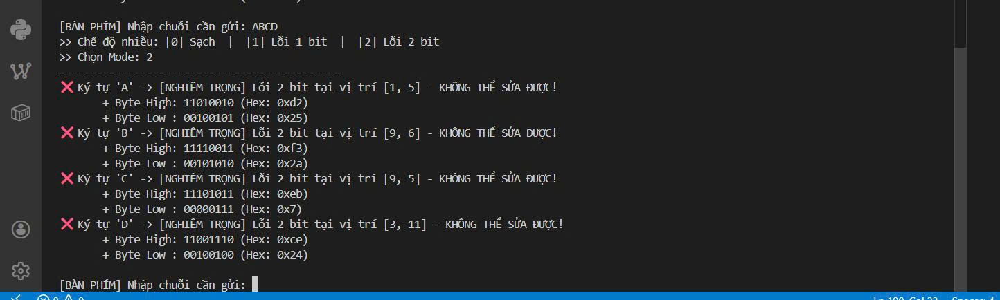
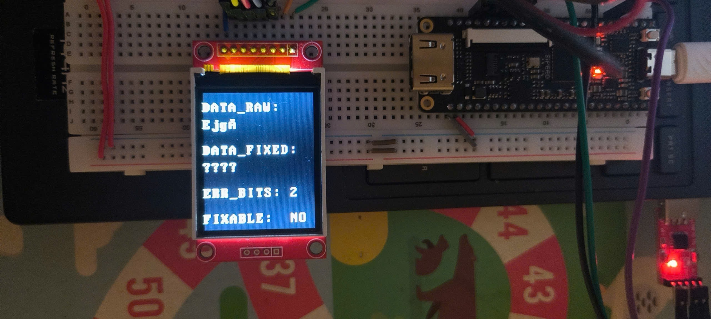

# PicoRV32 Custom SoC on Tang Nano 9K FPGA

[](https://en.wikipedia.org/wiki/Field-programmable_gate_array)
[](https://riscv.org/)
[](https://en.wikipedia.org/wiki/Verilog)
[](https://www.gowinsemi.com/)

## 📝 Overview
This project is a complete, bare-metal **System-on-Chip (SoC)** built around the **PicoRV32 (RV32I)** RISC-V processor core, implemented on the **Sipeed Tang Nano 9K FPGA**. 

The primary goal of this project is to practice **Hardware-Software Co-design**, RTL digital design, and system integration. All peripherals (SPI TFT Controller, UART, ECC Hamming Decoder) are custom-designed from scratch in **Verilog HDL** and integrated into the CPU via the standard **Wishbone Bus**. The firmware is written entirely in bare-metal **C** and **RISC-V Assembly** without any operating system.

## 🏗️ System Architecture & Memory Map
The system uses the Wishbone interconnect to route signals between the PicoRV32 master and various custom slave peripherals. 



### Memory Map
Address decoding is handled by the `soc_interconnect` module based on the top 4 bits of the 32-bit address:

| Slave Peripheral | Base Address | Description |
| :--- | :--- | :--- |
| **Block RAM (BSRAM)** | `0x0000_0000` | 16 KB. Used for `.text`, `.data`, `.bss`, and Stack |
| **UART RX Controller** | `0x4000_0000` | Baudrate: 115200, 8N1 |
| **Hamming SEC-DED** | `0x5000_0000` | Extended Hamming (12,8) Hardware Decoder |
| **SPI TFT Controller** | `0x6000_0000` | Drives ST7735 (1.8" LCD), Hardware FSM |

## ✨ Key Features & RTL Modules

### 1. Custom SPI TFT Controller (Hardware FSM)
- Designed a custom Finite State Machine (FSM) to drive the ST7735 LCD directly via SPI Mode 0.
- **Timing Constraint Handling:** Resolved critical hold-time violations by implementing an `S_SPI_END` wait-state, ensuring the Clock signal pulls low safely before the Chip Select (`CS`) is deactivated.
- **Font ROM Integration:** Hardware-accelerated ASCII character rendering using an internal Font ROM, offloading the CPU from pixel-by-pixel calculation.

### 2. Error Correction Code (Hamming SEC-DED)
- Implemented an extended Hamming (12,8) algorithm in hardware.
- Capable of **Single Error Correction (SEC)** and **Double Error Detection (DED)** for 16-bit memory packets.
- Provides Wishbone registers for the CPU to inject raw data, read clean data, and monitor error status flags via MMIO.

### 3. Bare-Metal Firmware Development
- Custom `start.s` (Assembly) to configure the environment, set up the Stack Pointer (`sp`), and hand off execution to `main()`.
- Custom linker script (`section.lds`) to map memory sections explicitly to the FPGA's 16KB Block RAM space.
- Direct Memory-Mapped I/O (MMIO) programming in C using `volatile` pointers for hardware control.

## 🔌 Hardware Setup & Pinout
- **Development Board:** Sipeed Tang Nano 9K (GW1NR-9 FPGA).
- **Display:** 1.8" SPI TFT LCD (ST7735).

**Pin Constraints (`.cst`) Mapping:**
*Note: The MSPI/SSPI dedicated pins were bypassed by configuring "Dual Purpose Pins" in Gowin EDA to avoid hardware boot conflicts.*

| TFT Screen Pin | Tang Nano 9K Pin | I/O Type |
| :--- | :--- | :--- |
| VCC | 3.3V | Power |
| GND | GND | Ground |
| CS | 56 | LVCMOS33 |
| DC / RS | 55 | LVCMOS33 |
| RES / RESET | 54 | LVCMOS33 |
| SDA / MOSI | 53 | LVCMOS33 |
| SCL / SCK | 51 | LVCMOS33 |
| **UART RX** | **25** | **LVCMOS33** |

## 📁 Repository Structure
```text
├── rtl/                  # Verilog source files (PicoRV32, Peripherals, Interconnect)
│   ├── core/
│   ├── interconnect/
│   └── peripherals/
├── firmware/             # Bare-metal C code, start.s, Linker script (.lds)
│   ├── src/
│   └── scripts/
├── tb/                   # Verilog Testbenches for Simulation
├── hw_config/            # Gowin EDA constraints (.cst, .sdc)
├── tools/                # Python utility scripts (UART TX, Hex Generator)
└── README.md
```
## 🚀 Getting Started

### Prerequisites

1.  **Gowin EDA** (V1.9.9 or later) for Synthesis, Place & Route, and Programming.
2.  **RISC-V GNU Compiler Toolchain** (`riscv64-unknown-elf-gcc`) for compiling the C firmware.
3.  **Python 3** (for running the UART transmission script).

### Build & Run

1.  **Compile the Firmware:**
    Navigate to the `firmware/` directory and compile the code to generate `firmware.hex`.

2.  **Synthesize & Route:**
    *   Open the project in Gowin EDA.
    *   Ensure the `firmware.hex` path is correctly mapped in the `soc_ram.v` `$readmemh()` function.
    *   Run **Synthesize -> Place & Route**.

3.  **Flash the FPGA:**
    *   Open the Gowin Programmer.
    *   Flash the generated `.fs` file to the Tang Nano 9K via SRAM/Flash mode.

4.  **Test the System:**
    *   Run the Python script in the `tools/` folder to inject clean/corrupted Hamming-encoded packets via UART and observe the hardware correction on the TFT screen.

## 🛠️ Simulation & Verification

*   Unit testing and SoC integration testing were performed using `soc_system_tb.v`.
*   Monitored signals via ModelSim/GTKWave to debug Wishbone handshaking (`stb`, `cyc`, `ack`) and verify SPI bit-banging waveforms before hardware deployment.
## 📸 System in Action: Hamming SEC-DED Demonstration

To demonstrate the error correction capabilities, a Python script injects noise into the UART payload before transmitting it to the FPGA. The hardware Hamming decoder processes the packet and displays the results in real-time.

### Mode 0: Clean Data Transmission (No Errors)
The payload is transmitted normally. The FPGA correctly identifies 0 error bits.

| Python Terminal (Transmitter) | TFT LCD (FPGA Receiver) |
| :---: | :---: |
|  |  |

### Mode 1: Single-Bit Error (Correctable)
The Python script flips exactly 1 random bit in the 16-bit packet. The hardware decoder detects the error (e.g., received `BACD` instead of `ABCD`), successfully **fixes the bit in hardware**, and recovers the original `ABCD` payload.

| Python Terminal (Transmitter) | TFT LCD (FPGA Receiver) |
| :---: | :---: |
|  |  |

### Mode 2: Double-Bit Error (Uncorrectable)
The Python script flips 2 random bits. The SEC-DED algorithm detects a fatal 2-bit collision (`ERR_BITS: 2`). Since it exceeds the single-bit correction limit, the hardware correctly flags the data as unfixable (`FIXABLE: NO`) and displays `????` to prevent data corruption.

| Python Terminal (Transmitter) | TFT LCD (FPGA Receiver) |
| :---: | :---: |
|  |  |

## 👤 Author
**Dang Thanh Son**
- **Email:** sondangthanh250504@gmail.com